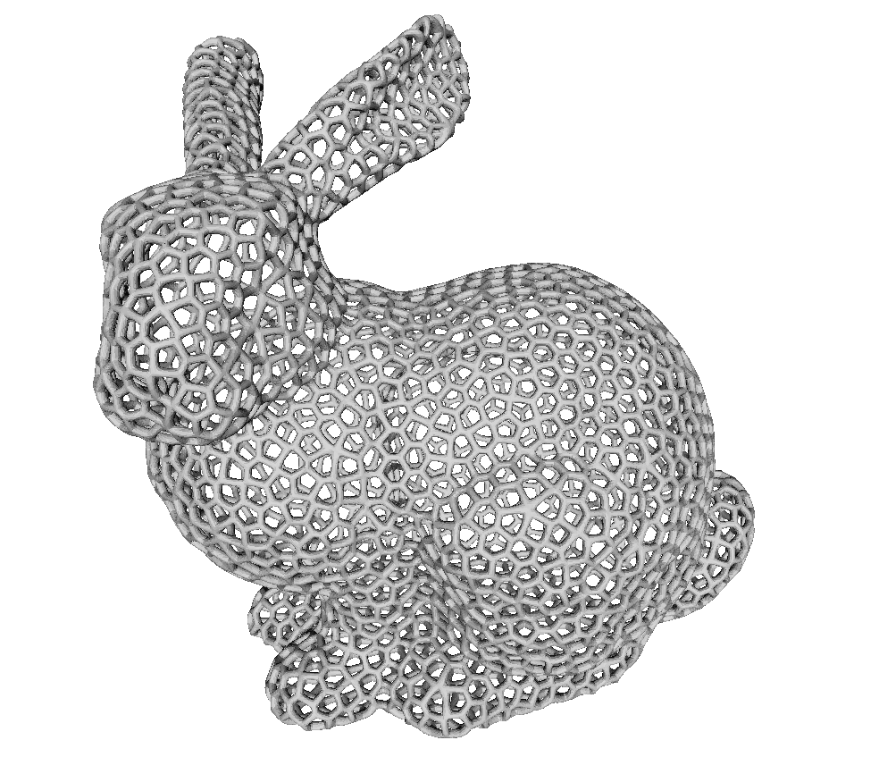
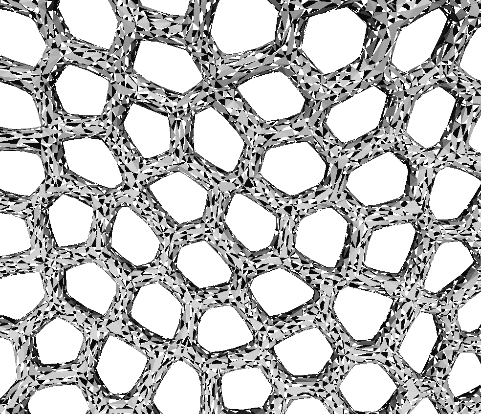

## Compression of Triangulated Solids’ Surfaces by Decimating Reconstructable Triangles

This program performs a triangular mesh decimation and reconstruction.

### Compilation
Execute command in the root folder:
`mvn clean install` **(JDK11 or higher required)**

### Running
Once compilation is complete, extract the contents of the `CoToS-1.0-SNAPSHOT-release.zip` archive to a suitable directory.

Using command prompt (or bash), execute the command: `java -jar CoToS-1.0-SNAPSHOT.jar`

This will print out usage:

```
$ java -jar CoToS-1.0-SNAPSHOT.jar
Decimate: c input.[obj|stl|...any assimp supported format].
Reconstruct: d input.[obj|stl|...any assimp supported format].CoToS
```

*3D object reading and writing is done using ASSIMP (https://github.com/kotlin-graphics/assimp)*

### Example

To decimate the object run: `java -jar CoToS-1.0-SNAPSHOT.jar c bunny.obj` **(object must be a watertight triangular mesh)**

**Input**



**Decimated output**


**Decimated output closeup**



To reconstruct the decimated object run: `java -jar CoToS-1.0-SNAPSHOT.jar d bunny.obj.CoToS`

**Reconstructed output**


